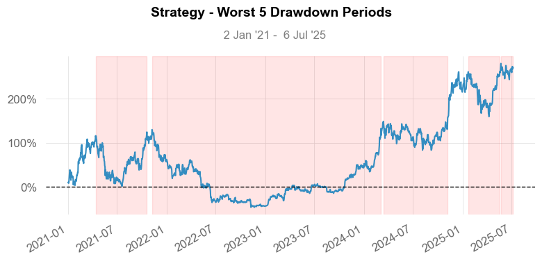

# Quantstats Reload

## - [Quantstats](https://github.com/ranaroussi/quantstats) Reloaded Version

## - Credit: [Ran Aroussi](https://github.com/ranaroussi)

Last update: 2025-07-08

Fixed bugs and adopted to latest Numpy, Pandas and Seaborn

Numpy ver: 1.26.4<BR>
Pandas ver: 2.2.3<BR>
Seaborn ver: 0.13.2<BR>
Quantstats ver: 0.0.65 - Reloaded by Honcy Lee<BR>

```python
import QuantstatsReload as qs
import seaborn as sns
import yfinance as yf
import numpy as np
import pandas as pd

# extend pandas functionality with metrics, etc.
qs.extend_pandas()

print('Numpy ver:\t', np.__version__)
print('Pandas ver:\t', pd.__version__)
print('Seaborn ver:\t', sns.__version__)
print('Quantstats ver:\t', qs.__version__)
```

    Numpy ver:	 1.26.4
    Pandas ver:	 2.2.3
    Seaborn ver:	 0.13.2
    Quantstats ver:	 0.0.65 - Reloaded by Honcy Lee

```python
# fetch data in specific date
ticker = 'BTC-USD' # yfinance ticker only

stock = yf.download(ticker, start='2021-01-01', end='2025-07-07',
                   progress=False, auto_adjust=True).droplevel('Ticker',axis=1)['Close'].pct_change(1)

# show sharpe ratio (annualised)
qs.stats.sharpe(stock)
```

    0.6509832228452953

```python
stock.plot_snapshot(title=f'{ticker} Performance', show=True)
```


```python
qs.reports.metrics(stock, mode='basic')
```

                        Strategy
    ------------------  ----------
    Start Period        2021-01-02
    End Period          2025-07-06
    Risk-Free Rate      0.0%
    Time in Market      100.0%

    Cumulative Return   271.86%
    CAGR﹪              22.27%

    Sharpe              0.65
    Prob. Sharpe Ratio  95.23%
    Sortino             0.97
    Sortino/√2          0.68
    Omega               1.13

    Max Drawdown        -76.63%
    Longest DD Days     846

    Gain/Pain Ratio     0.13
    Gain/Pain (1M)      0.79

    Payoff Ratio        1.12
    Profit Factor       1.13
    Common Sense Ratio  1.17
    CPC Index           0.63
    Tail Ratio          1.04
    Outlier Win Ratio   4.26
    Outlier Loss Ratio  4.21

    MTD                 1.96%
    3M                  30.81%
    6M                  11.1%
    YTD                 16.91%
    1Y                  92.78%
    3Y (ann.)           44.15%
    5Y (ann.)           22.27%
    10Y (ann.)          22.27%
    All-time (ann.)     22.27%

    Avg. Drawdown       -12.68%
    Avg. Drawdown Days  64
    Recovery Factor     2.79
    Ulcer Index         0.42
    Serenity Index      0.21

```python
qs.reports.metrics(stock, mode='full')
```

                               Strategy
    -------------------------  ----------
    Start Period               2021-01-02
    End Period                 2025-07-06
    Risk-Free Rate             0.0%
    Time in Market             100.0%

    Cumulative Return          271.86%
    CAGR﹪                     22.27%

    Sharpe                     0.65
    Prob. Sharpe Ratio         95.23%
    Smart Sharpe               0.62
    Sortino                    0.97
    Smart Sortino              0.93
    Sortino/√2                 0.68
    Smart Sortino/√2           0.66
    Omega                      1.13

    Max Drawdown               -76.63%
    Longest DD Days            846
    Volatility (ann.)          50.15%
    Calmar                     0.29
    Skew                       0.13
    Kurtosis                   3.49

    Expected Daily %           0.08%
    Expected Monthly %         2.42%
    Expected Yearly %          30.04%
    Kelly Criterion            5.64%
    Risk of Ruin               0.0%
    Daily Value-at-Risk        -5.07%
    Expected Shortfall (cVaR)  -5.07%

    Max Consecutive Wins       10
    Max Consecutive Losses     8
    Gain/Pain Ratio            0.13
    Gain/Pain (1M)             0.79

    Payoff Ratio               1.12
    Profit Factor              1.13
    Common Sense Ratio         1.17
    CPC Index                  0.63
    Tail Ratio                 1.04
    Outlier Win Ratio          4.26
    Outlier Loss Ratio         4.21

    MTD                        1.96%
    3M                         30.81%
    6M                         11.1%
    YTD                        16.91%
    1Y                         92.78%
    3Y (ann.)                  44.15%
    5Y (ann.)                  22.27%
    10Y (ann.)                 22.27%
    All-time (ann.)            22.27%

    Best Day                   18.75%
    Worst Day                  -15.97%
    Best Month                 43.72%
    Worst Month                -37.77%
    Best Year                  155.42%
    Worst Year                 -64.27%

    Avg. Drawdown              -12.68%
    Avg. Drawdown Days         64
    Recovery Factor            2.79
    Ulcer Index                0.42
    Serenity Index             0.21

    Avg. Up Month              15.44%
    Avg. Down Month            -12.05%
    Win Days %                 50.09%
    Win Month %                58.18%
    Win Quarter %              57.89%
    Win Year %                 80.0%

```python
qs.reports.plots(stock, mode='basic')
```


```python
qs.reports.plots(stock, mode='full')
```





```python

```
